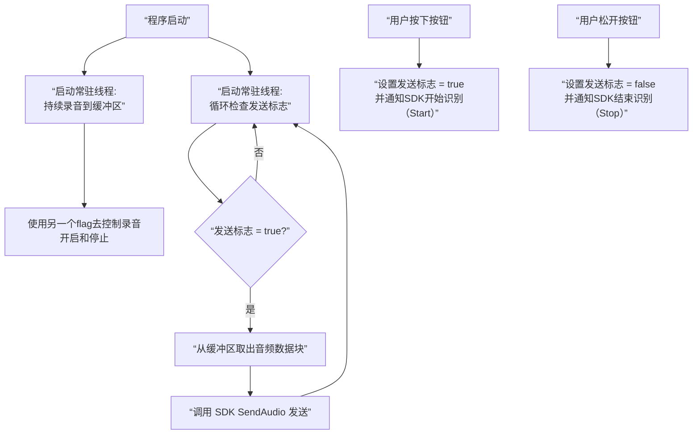

# Alibaba multimodal application linux demo

System Version: Ubuntu 22.04, ffmpeg version 4.4.2

## 文件内容说明: 
```
Linux_Multimodal_App/  
│── build        Linux下可执行程序以及cmake编译仓库 
│── external       三方库文件如json  
│── include    SDK接口需要的头文件，程序需要的头文件 
│── lib  
│   └── libconversation.so    SDK成果物动态库  
│── resources   SDK运行需要的资源文件, 根据业务场景选择 
│── resources_aec_kws_vad_android       VAD声音检测文件 
│── README.md       说明文件
│── CMakeLists.txt      cmake编译文件
└── audio_16k.pcm/wav    测试音频文件
```

## 手动编译方法 -- 可以跳过使用cmake进行编译
1. 编译：
```bash
g++ -std=c++11 \
  linux_cpp_multimodal/Linux_Multimodal_App/src/main.cpp \
  linux_cpp_multimodal/Linux_Multimodal_App/src/conversation_handler.cpp \
  linux_cpp_multimodal/Linux_Multimodal_App/src/audio_handler.cpp \
  linux_cpp_multimodal/Linux_Multimodal_App/external/jsoncpp.cpp \
  -I linux_cpp_multimodal/Linux_Multimodal_App/include \
  -I linux_cpp_multimodal/Linux_Multimodal_App/external \
  -I linux_cpp_multimodal/Linux_Multimodal_App/src \
  -L linux_cpp_multimodal/Linux_Multimodal_App/lib \
  -lconversation -ldl -lpthread -lz \
  -o linux_cpp_multimodal/Linux_Multimodal_App/conv_demo
```

2. 运行：
```bash
LD_LIBRARY_PATH=linux_cpp_multimodal/Linux_Multimodal_App/lib ./linux_cpp_multimodal/Linux_Multimodal_App/conv_demo --apikey bababa --url wss://dashscope.aliyuncs.com/api-ws/v1/inference
```

3. 上传音频后会返回二进制文档如`binary_*.pcm`在`tmp/`文档下。随后根据下面的步骤对回复内容进行恢复。

- 合并binary文本：
```bash
 cat /home/zijian/tmp/binary_*.pcm > complete_audio.pcm
```

- ffmpeg转换成mp3音频检查回复:
```bash
ffmpeg -f s16le -ar 24000 -ac 1 -i /home/zijian/complete_audio.pcm   -acodec libmp3lame -b:a 128k /home/zijian/complete_audio.mp3
```

## 使用cmake进行编译项目

1. `cd build`进入build文件夹。

2. 如果build文件夹中有剩余文件，`rm -rf *`清空文件夹。

3. `cmake ..` 生成构建系统文件， 告诉cmake源码文件夹的路径，并且在当前文件夹构建。

4. `make -j4` **make** 表示读取当前文件夹MakeFile的内容并且开始编译。 **-j4** 表示同时使用四个线程进行编译任务。

5. 运行：`./conv_demo --apikey 12345 --url 12345`。

## 如何使用这个程序

此Demo运行在Linux系统，因此采用的是CLI界面进行操作。本程序简单实现了三个交互功能可供测试。

 - 第一个功能为预先录制好的语音上传，这个语言预先被解析为`pcm`类型的文件。随后采用流式上传的方式模拟真实语音上传。上传语音时会创建一个单独的分离线程在后台进行，执行完后自动销毁。随后程序会触发SDK回调程序`onMessage`中的`kbinary`接受云端模型的回复。最后会储存为`.mp3`音频。

 > 程序执行方式：程序启动初始化成功后，在TERMINAL上按`1`。

 - 第二个功能为测试文本合成TTS，预先写好一段话，请求云端的模型下发这一段文字的合成语音。

 > 程序执行方式： 程序启动初始化成功后，在TERMINAL上按`2`。

 - 第三个功能为Visual Question Answering(VQA), 本地储存一张`.jpg`图片。使用SDK把图片解析为BASE64格式上传。接收云端模型回复。

 > 程序执行方式： 程序启动初始化成功后，在TERMINAL上按`3`。

## 实际录音逻辑流程图



- 共享数据的线程安全：audioCaptureThread 和 audioSendThread 会同时操作音频数据队列，必须使用互斥锁（std::mutex） 来保护，否则程序会因数据竞争而崩溃。

- 原子操作标志位：控制发送的 g_isSending 标志位会被多个线程读写，必须声明为 std::atomic<bool> 以确保状态变更的即时性和安全性。

- 按下按钮时的“清空”操作：在按下按钮、将 g_isSending 设为 true 之前，务必清空音频缓冲区队列。否则，积压在队列里的旧环境噪音会被当作“第一句话”发送出去，导致识别出错。


## 构建Docker镜像 --> 运行Docker容器

1. 进入工作文件的根目录`Linux_Multimodal_App`。
```bash
docker build -t multimodal-demo:v1.0 .
```

2. 启动新容器并且进入bash
```bash
# 启动并在退出后删除
docker run -it --rm --entrypoint /bin/bash multimodal-demo:v1.0

# 启动并命名容器(不用--rm，命名容器为mydebug)
docker run -it --name mydebug multimodal-demo:v1.0 /bin/bash
# 退出后重新进入
docker start mydebug
docker exec -it mydebug /bin/bash

# delete
docker rm -f mydebug
```
 - ctrl + D 可退出，容器自动删除。
 - please download **Docker** and **Container tools** in vscode. Then you can get the return mp3 file from AI.
